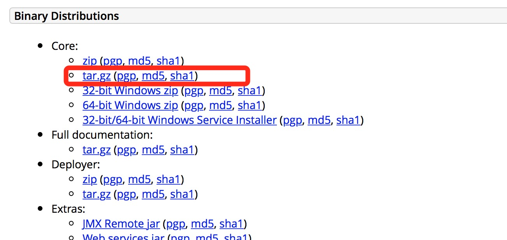
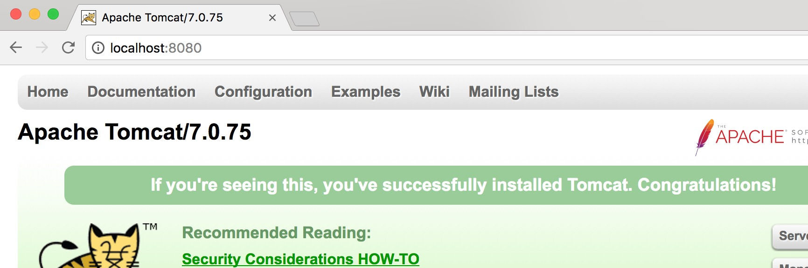
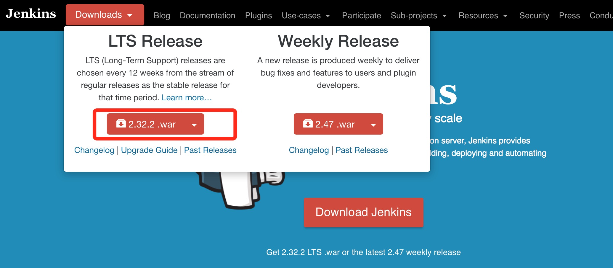
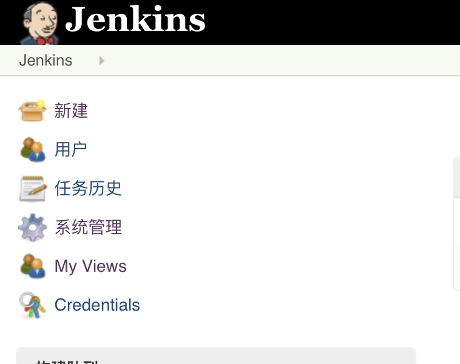
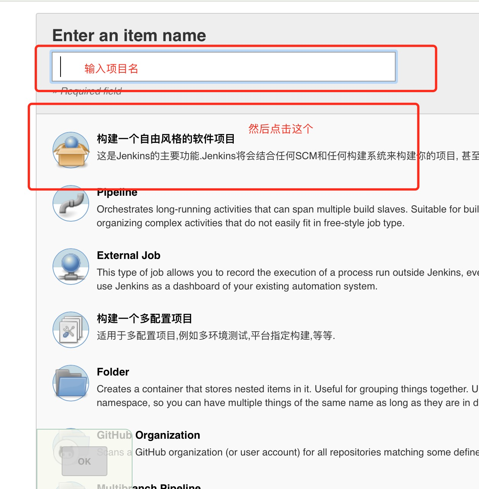
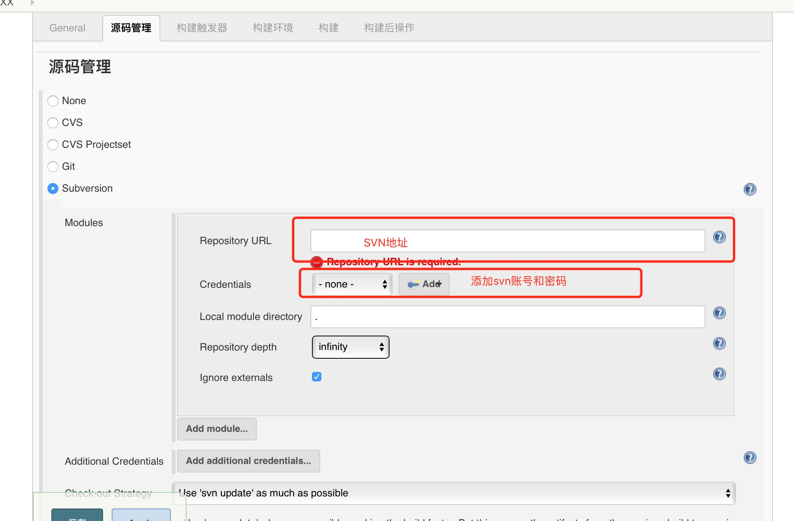
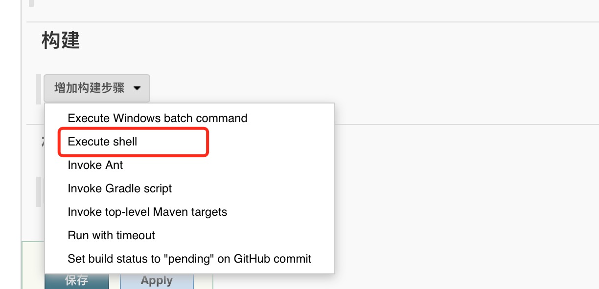
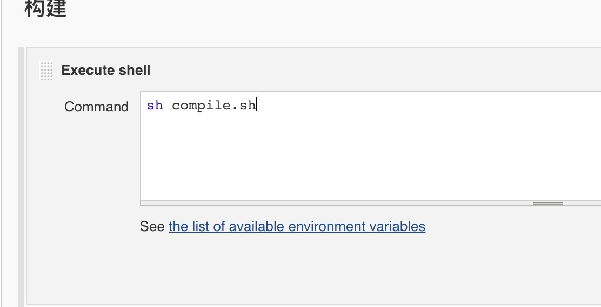
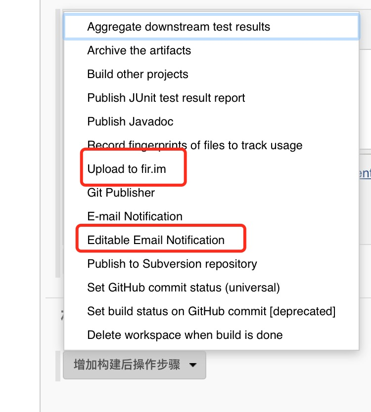

#<center>Mac平台Jenkins环境搭建</center>
采用Jenkins的pgk安装，会自动在电脑上生成一个Jenkins用户，导致Jenkins在执行iOS构建的时候没有权限去获取证书，所以最终选用tomcat+Jenkins.war去部署

>###下载<a href="http://tomcat.apache.org/download-70.cgi">tomcat</a>



* 下载完后将其解压，然后使用终端执行```mv apache-tomcat-7.0.75/ ~/Library/Tomcat```命令
* tomcat的目录结构以及用途
	* bin: 存放的是tomcat相关的可执行文件，比如启动和停止tomcat服务脚本
	* conf: 存放的是tomcat相关配置文件
	* lib: 存放的tomcat需要使用的相关jar文件
	* logs: 存放tomcat日志文件
	* temp: 主要存放部署在tomcat下网站运行时的一些临时文件
	* webapps: 部署web应用时一般需要将其存放在此目录下，后续我们的Jenkins.war就需要存放至此
	* work: tomcat自动生成，放置tomcat运行时的临时文件
* 打开终端cd到bin目录下，执行```sh startup.sh```启动tomcat服务，执行```sh shutdown.sh```关闭服务。当然每次这样切换目录去启动和关闭tomcat比较麻烦，所以写一个shell脚本比较好，下面是我的脚本:

```
#tomcat.sh
#!/bin/sh

case $1 in
start)
sh ~/Library/Tomcat/bin/startup.sh
;;
stop)
sh ~/Library/Tomcat/bin/shutdown.sh
;;
restart)
sh ~/Library/Tomcat/bin/shutdown.sh
sh ~/Library/Tomcat/bin/startup.sh
;;
*)
echo "输入错误.Usage start|stop|restart"
esac

```
* 下面就可以验证tomcat是否安装成功，直接执行```sh tomcat.sh start```，出现如下页面则代表安装成功:

至此tomcat的安装就算完成了，接下来就开始部署Jenkins了！

>###下载<a href="https://jenkins.io/index.html">Jenkins</a>

使用tomcat我们需要下载Jenkins.war包而不是Jenkins.pgk安装包


* 将下载完的Jenkins.war移动到Tomcat目录下的webapps中
* 启动tomcat服务，打开浏览器输入<a href="http://localhost:8080/jenkins/login?from=%2Fjenkins">http://localhost:8080/jenkins</a>接下来的安装步骤就不写了，不会的网上一大推，此处就省略了。。。
* 创建用户登录后会进入主页
* 新建项目
* 配置项目源码管理(这里我使用的是svn)
* 然后就可以添加项目构建脚本了
* 当然这里还可以添加构建后的动作，比如打包好了后发送邮件给测试并将包上传到fir上
* 然后就可以点击保存并点击立即构建就可以了。